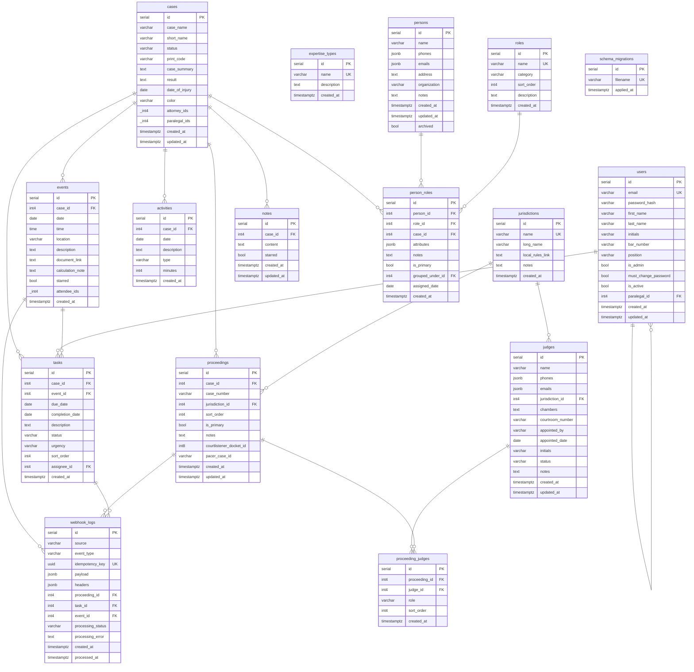

# Database Schema

Entity-relationship diagram for the Galipo legal case management system.

> **Auto-generated** on 2026-02-06 14:53:36 by `scripts/generate_schema_diagram.py`
> (via [SchemaCrawler](https://www.schemacrawler.com/) Docker image)
>
> To regenerate: `python scripts/generate_schema_diagram.py`
>
> Requires Docker.

## ER Diagram



## JSONB Column Details

### persons.phones / persons.emails / judges.phones / judges.emails
```json
[
  {"value": "+1-555-1234", "primary": true, "label": "Cell"},
  {"value": "+1-555-5678", "primary": false, "label": "Office"}
]
```

### person_roles.attributes
Flexible JSON for role-specific case data. For experts:
```json
{"expertises": ["Accident Reconstruction", "Biomechanics"], "hourly_rate": 450}
```

## Enum Values

### Case Statuses
- Signing Up, Prospective, Pre-Filing, Pleadings, Discovery
- Expert Discovery, Pre-trial, Trial, Post-Trial, Appeal
- Settl. Pend., Stayed, Closed

### Task Statuses
- Pending, Active, Done, Partially Done, Blocked, Awaiting Atty Review

### Task Urgency
- Low, Medium (default), High, Urgent

### Activity Types
- Meeting, Filing, Research, Drafting, Document Review
- Phone Call, Email, Court Appearance, Deposition, Other

### Role Categories (app-level validation via `db/validation.py`)
- client, counsel, defendant, expert, mediator, other

## Schema Design Notes

### Unified Roles System
The `roles` table defines role types with a `category` CHECK constraint. The `person_roles`
junction table links persons to roles, optionally scoped to a case via `case_id`. Role-specific
data is stored in the JSONB `attributes` column (e.g., expertises for expert roles).

### Standalone Judges
Judges are separate from persons — they have their own table with jurisdiction-specific
fields (chambers, courtroom_number, appointed_by). They are linked to proceedings
via the `proceeding_judges` junction table.

### Multi-Jurisdiction Support
Cases can have multiple proceedings in different jurisdictions. The `proceedings` table
links cases to jurisdictions with case numbers. A partial unique index enforces that
only one proceeding per case can be marked as primary.

### Soft Deletes
The `persons.archived` boolean flag is used for soft deletes rather than removing rows.
