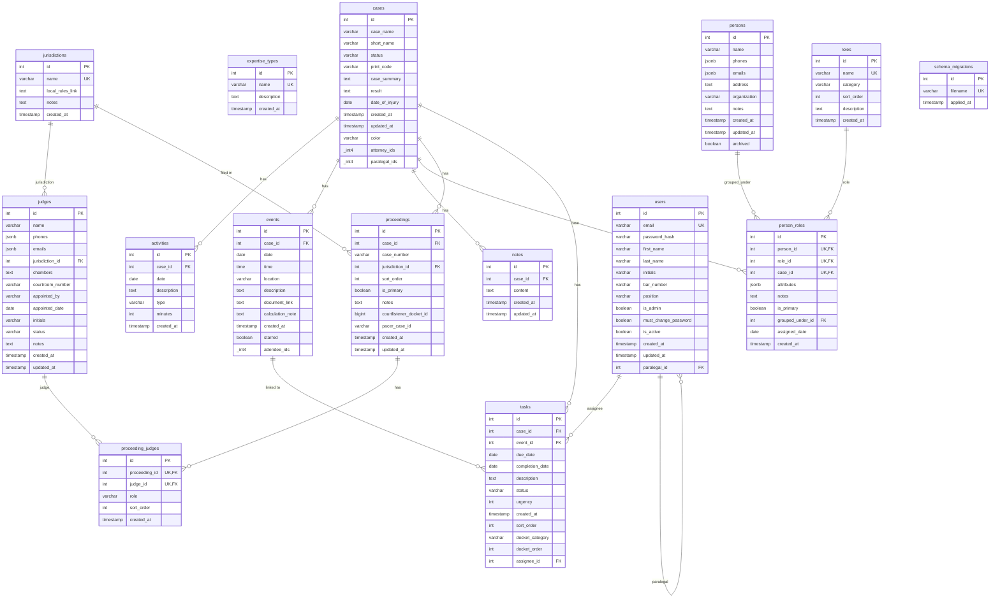

# Database Schema

Entity-relationship diagram for the Galipo legal case management system.

> **Auto-generated** on 2026-02-06 13:50:07 by `scripts/generate_schema_diagram.py`
>
> To regenerate: `python scripts/generate_schema_diagram.py`

## ER Diagram



## Table Relationships

| Parent | Child | FK Column | On Delete |
|--------|-------|-----------|-----------|
| cases | activities | case_id | CASCADE |
| cases | events | case_id | CASCADE |
| jurisdictions | judges | jurisdiction_id | SET NULL |
| cases | notes | case_id | CASCADE |
| cases | person_roles | case_id | CASCADE |
| persons | person_roles | grouped_under_id | SET NULL |
| persons | person_roles | person_id | CASCADE |
| roles | person_roles | role_id | RESTRICT |
| judges | proceeding_judges | judge_id | CASCADE |
| proceedings | proceeding_judges | proceeding_id | CASCADE |
| cases | proceedings | case_id | CASCADE |
| jurisdictions | proceedings | jurisdiction_id | NO ACTION |
| users | tasks | assignee_id | SET NULL |
| cases | tasks | case_id | CASCADE |
| events | tasks | event_id | SET NULL |
| users | users | paralegal_id | SET NULL |

## JSONB Column Details

### cases.case_numbers
```json
["2023-CV-12345", "2025-APP-00001"]
```
Tracks case across multiple courts/proceedings.

### contacts.phones / contacts.emails
```json
[
  {"value": "+1-555-1234", "primary": true, "label": "Cell"},
  {"value": "+1-555-5678", "primary": false, "label": "Office"}
]
```

### case_other_contacts.case_attributes
Flexible JSON for role-specific case data:
```json
{"specialty_for_case": "Accident Reconstruction", "testimony_topic": "Speed analysis"}
```

## Enum Values

### Case Statuses
- Signing Up, Prospective, Pre-Filing, Pleadings, Discovery
- Expert Discovery, Pre-trial, Trial, Post-Trial, Appeal
- Settl. Pend., Stayed, Closed

### Task Statuses
- Pending, Active, Done, Partially Done, Blocked, Awaiting Atty Review

### Task Urgency
- 1 = Low
- 2 = Medium (default)
- 3 = High
- 4 = Urgent

### Activity Types
- Meeting, Filing, Research, Drafting, Document Review
- Phone Call, Email, Court Appearance, Deposition, Other

### Contact Types (Discriminator)
- client, attorney, expert, judge, mediator, defendant
- lien_holder, witness, client_contact, other

### Case Assignment Sides
- plaintiff, defendant, neutral

## Schema Design Notes

### Class Table Inheritance Pattern
The `contacts` table serves as a base table with a `contact_type` discriminator column.
Type-specific tables (clients, attorneys, experts, etc.) extend contacts via foreign key
to `contacts.id` with `ON DELETE CASCADE`.

### Case Assignments
Each contact type has its own junction table (`case_clients`, `case_attorneys`, etc.)
rather than a single unified `case_persons` table. This allows type-specific fields
on the assignment (e.g., `case_experts` has `hourly_rate_override`, `case_lien_holders`
has `lien_amount` and `lien_status`).

### Multi-Jurisdiction Support
Cases can have multiple proceedings in different jurisdictions. The `proceedings` table
links cases to jurisdictions with case numbers. Judges are assigned to proceedings
(not cases) to support multi-judge panels.

### Soft Deletes
The `contacts.archived` boolean flag is used for soft deletes rather than removing rows.
