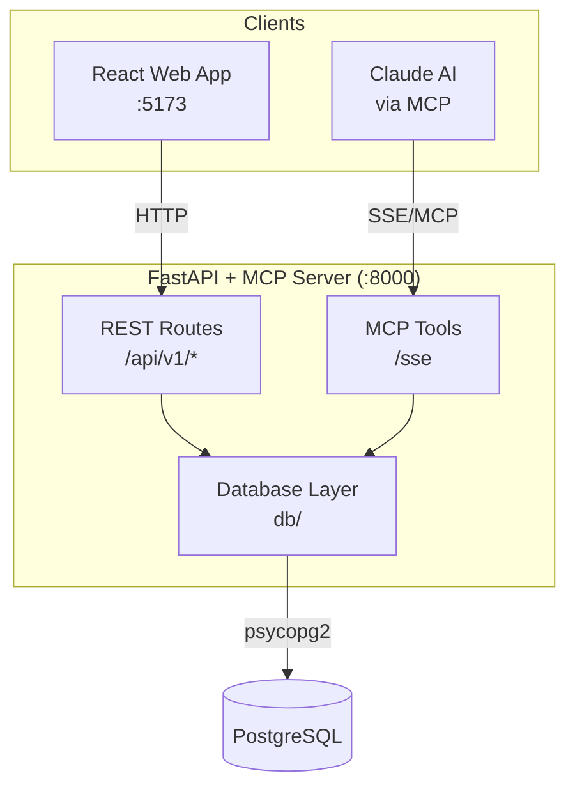
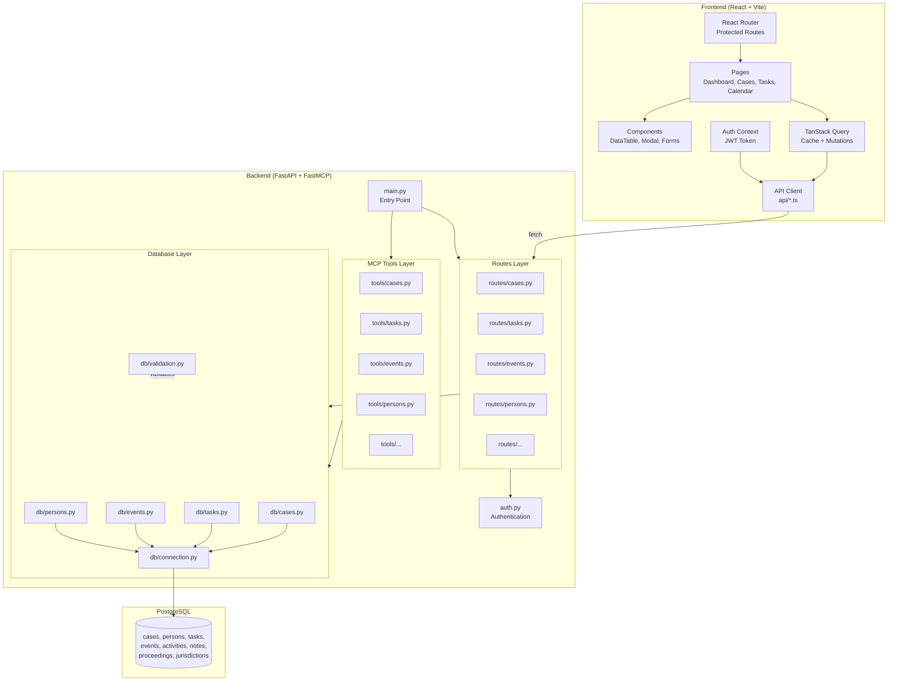
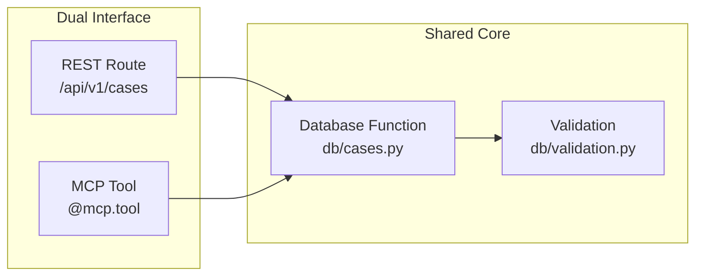
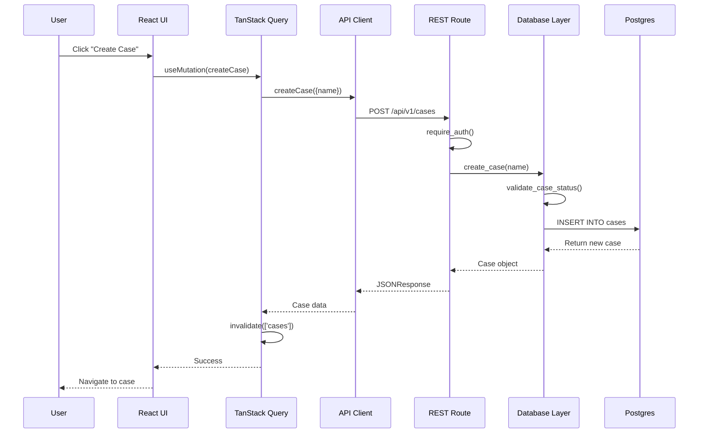
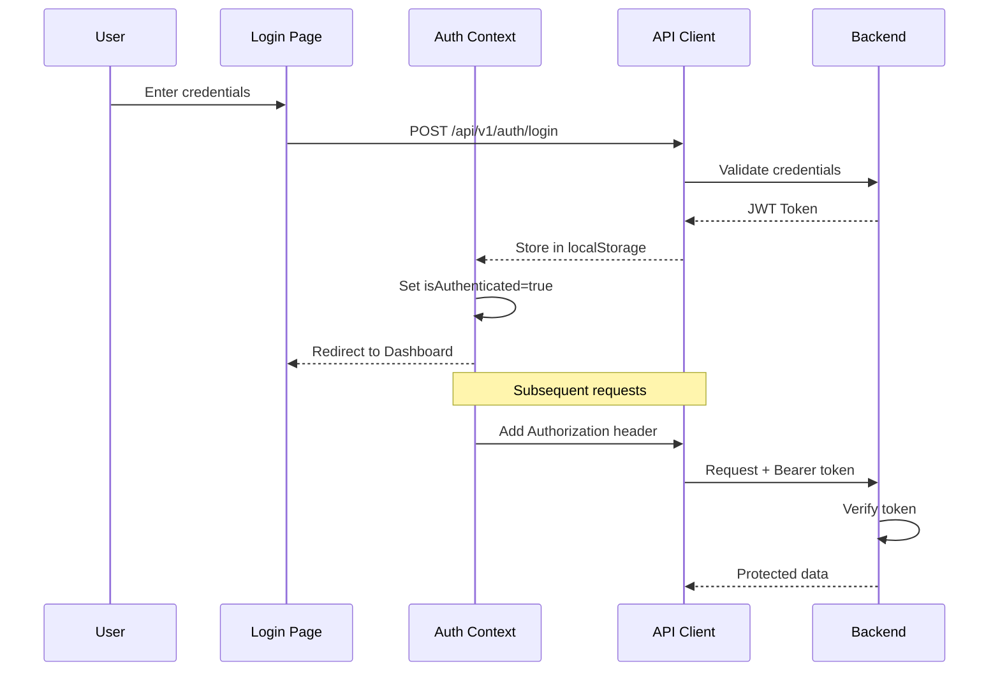
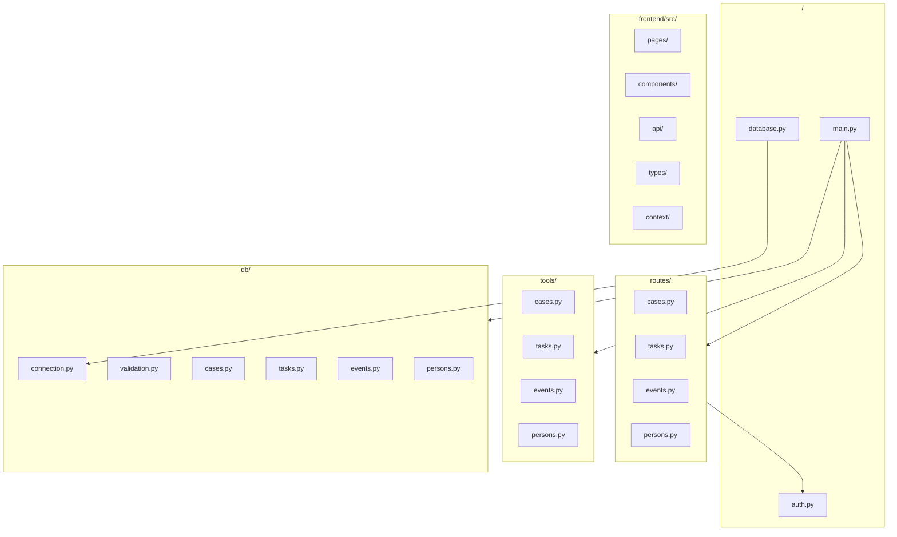
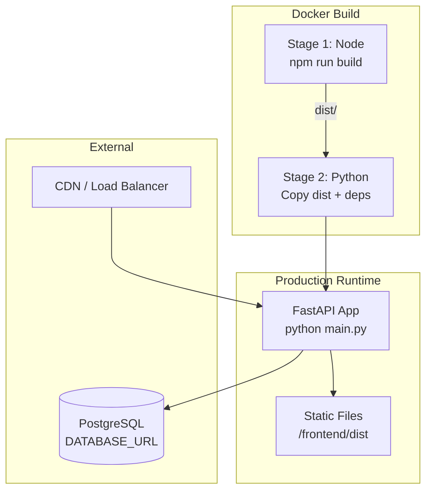

# System Architecture

Architecture diagrams for the Galipo legal case management system.

## High-Level Overview

## Detailed Component Architecture

## Three-Layer Pattern

Each domain follows the same modular pattern:

**Benefits:**
- Single source of truth for business logic
- Two interfaces (Web UI + AI) share same operations
- Easy to test each layer independently

## Data Flow: Create Case Example

## Authentication Flow

## Directory Structure

## Deployment Architecture

## Key Technologies

| Layer | Technology | Purpose |
|-------|------------|---------|
| Frontend | React 18 | UI Framework |
| Frontend | TanStack Query | Server state management |
| Frontend | TanStack Table | Data tables |
| Frontend | @dnd-kit | Drag and drop |
| Frontend | Tailwind CSS | Styling |
| Frontend | TypeScript | Type safety |
| Frontend | Vite | Build tool |
| Backend | FastAPI | Web framework |
| Backend | FastMCP | MCP server |
| Backend | psycopg2 | PostgreSQL driver |
| Database | PostgreSQL | Primary database |
| Database | JSONB | Flexible data storage |
