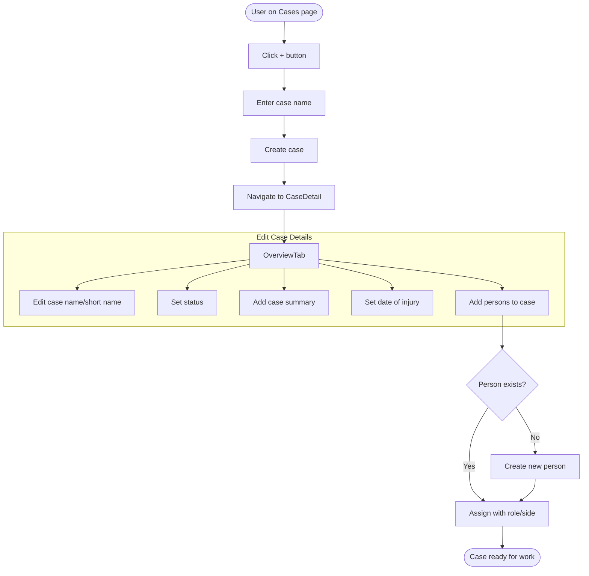
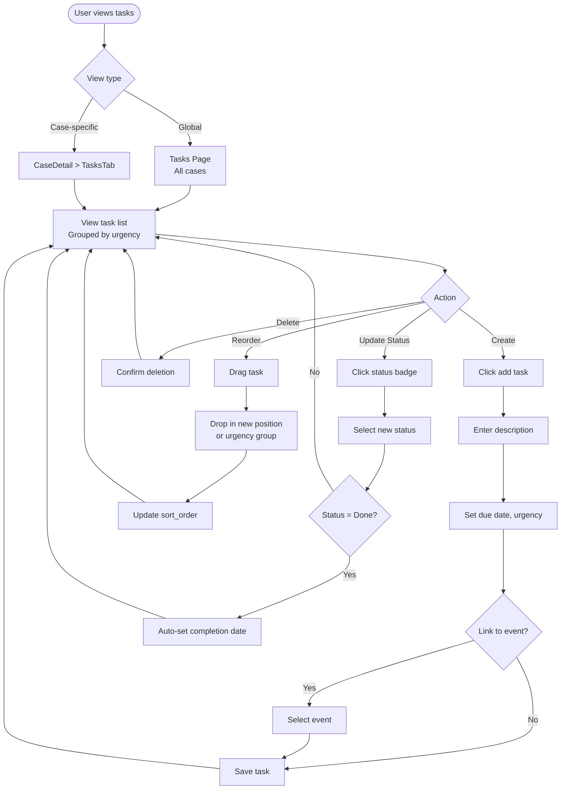
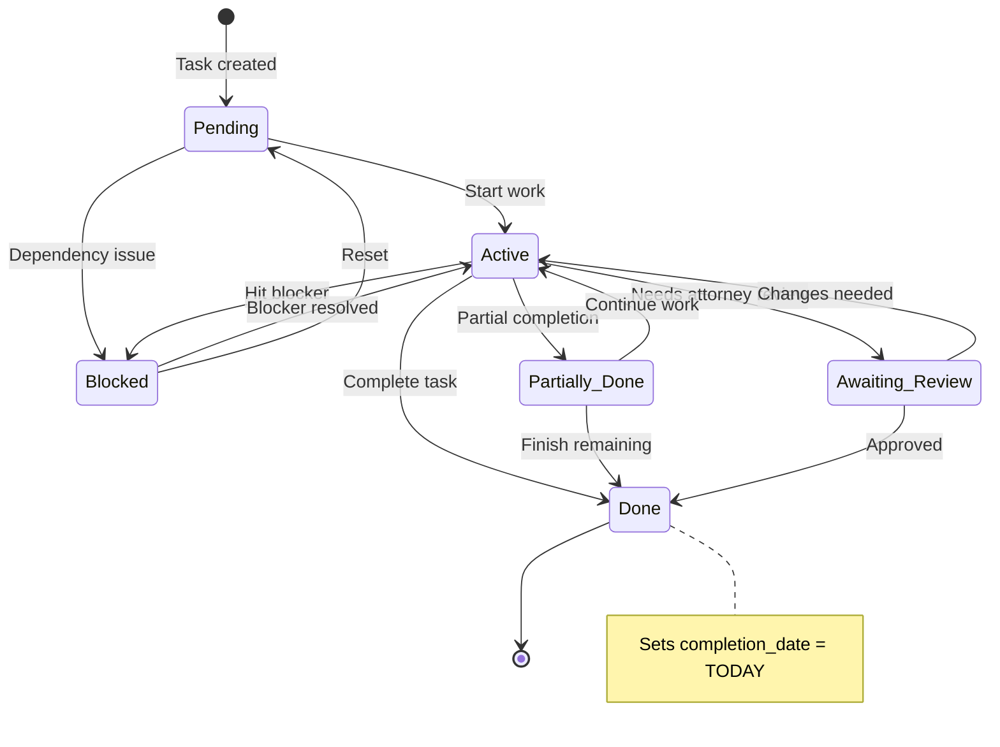
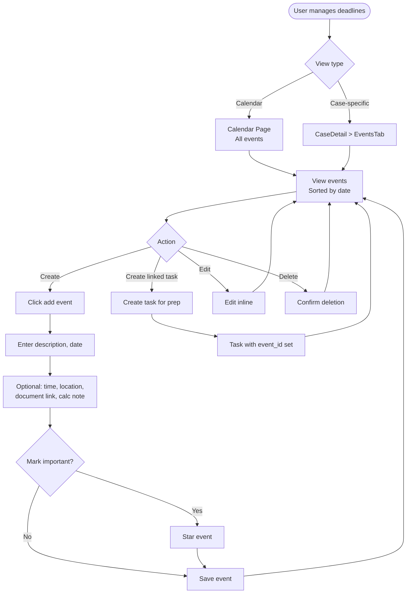
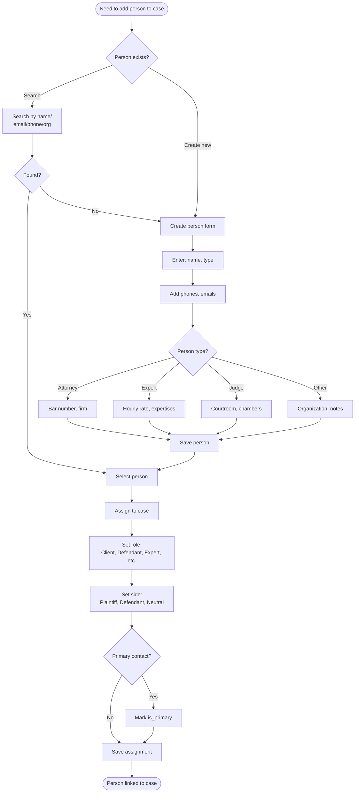
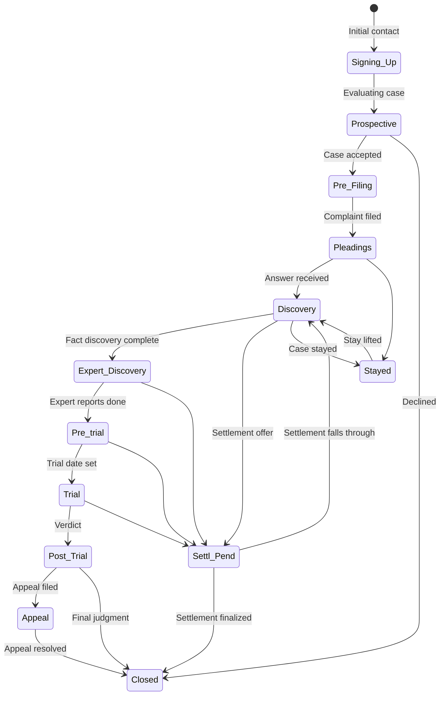
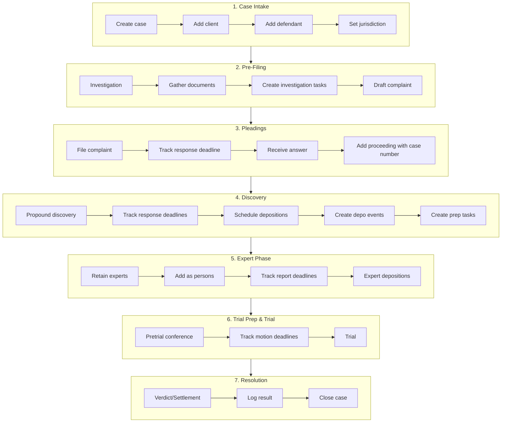
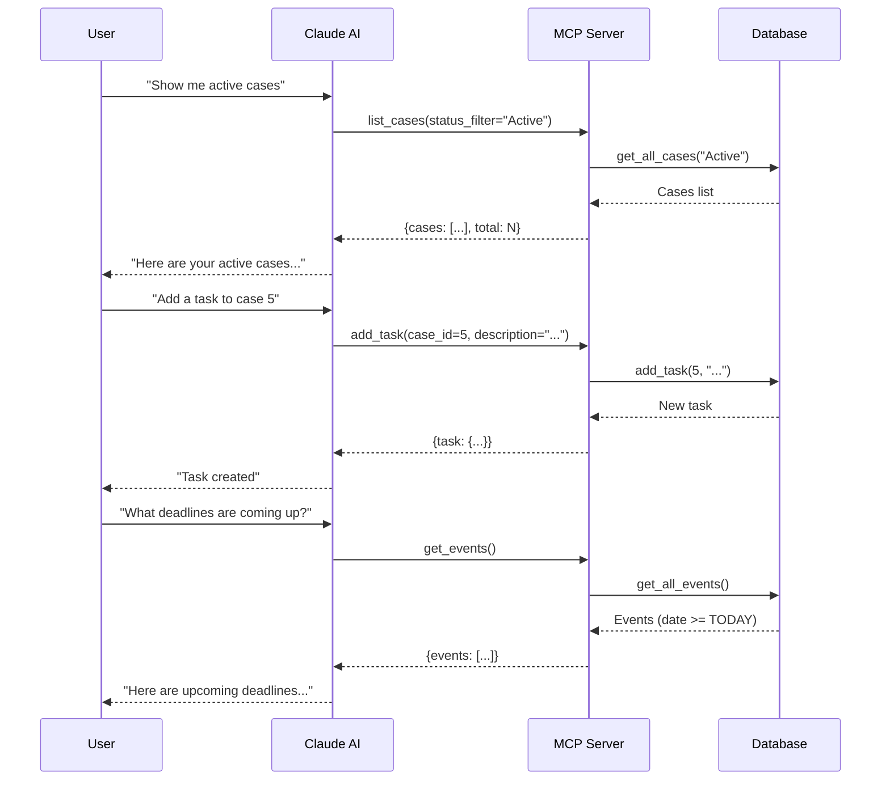
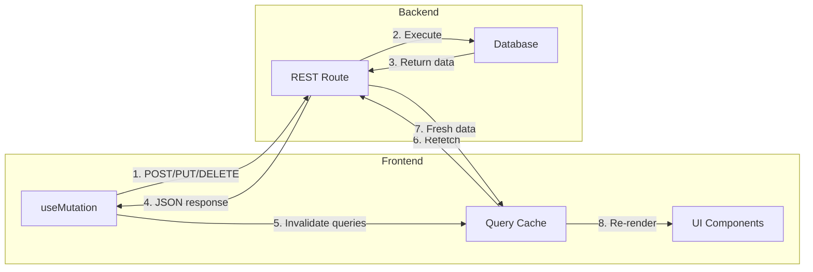

# Process Flows

User workflow diagrams for common operations in Galipo.

## Case Intake Workflow

## Task Management Workflow

## Task Status Flow

## Event/Deadline Management Workflow

## Person Management Workflow

## Case Lifecycle

## Full Case Workflow (End to End)

## MCP Tool Usage Flow (Claude AI)

## Data Synchronization Flow

