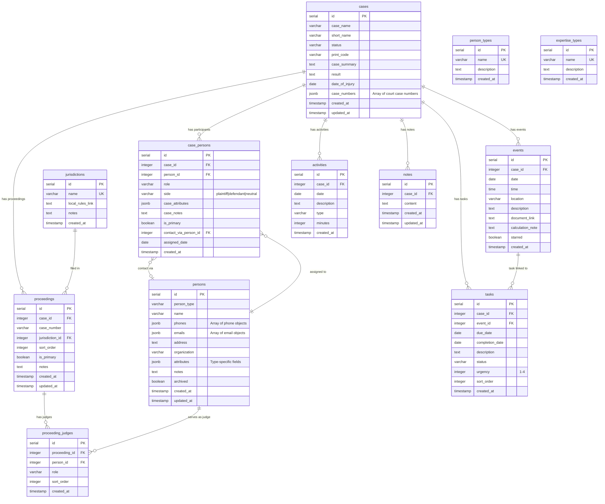

# Database Schema

Entity-relationship diagram for the Galipo legal case management system.

## ER Diagram



## Table Relationships

| Parent | Child | Relationship | On Delete |
|--------|-------|--------------|-----------|
| cases | case_persons | 1:many | CASCADE |
| persons | case_persons | 1:many | CASCADE |
| cases | proceedings | 1:many | CASCADE |
| jurisdictions | proceedings | 1:many | SET NULL |
| proceedings | proceeding_judges | 1:many | CASCADE |
| persons | proceeding_judges | 1:many | CASCADE |
| cases | tasks | 1:many | CASCADE |
| cases | events | 1:many | CASCADE |
| events | tasks | 1:many (optional) | SET NULL |
| cases | activities | 1:many | CASCADE |
| cases | notes | 1:many | CASCADE |

## JSONB Column Details

### cases.case_numbers
```json
["2023-CV-12345", "2025-APP-00001"]
```
Tracks case across multiple courts/proceedings.

### persons.phones / persons.emails
```json
[
  {"value": "+1-555-1234", "primary": true, "label": "Cell"},
  {"value": "+1-555-5678", "primary": false, "label": "Office"}
]
```

### persons.attributes
Type-specific fields stored as flexible JSON:

| Person Type | Example Attributes |
|-------------|-------------------|
| attorney | `{hourly_rate: 350, bar_number: "CA123456"}` |
| expert | `{hourly_rate: 500, deposition_rate: 600, expertises: ["Biomechanics"]}` |
| judge | `{courtroom_number: "4B", chambers: "Room 123"}` |
| mediator | `{half_day_rate: 2500, full_day_rate: 4500, style: "evaluative"}` |

### case_persons.case_attributes
Case-specific data for the assignment:
```json
{"fee_agreement": "contingency", "insurance_info": "Policy #XYZ"}
```

## Enum Values

### Case Statuses
- Signing Up, Prospective, Pre-Filing, Pleadings, Discovery
- Expert Discovery, Pre-trial, Trial, Post-Trial, Appeal
- Settl. Pend., Stayed, Closed

### Task Statuses
- Pending, Active, Done, Partially Done, Blocked, Awaiting Atty Review

### Task Urgency
- 1 = Low
- 2 = Medium (default)
- 3 = High
- 4 = Urgent

### Activity Types
- Meeting, Filing, Research, Drafting, Document Review
- Phone Call, Email, Court Appearance, Deposition, Other

### Person Types
- client, attorney, judge, expert, mediator, defendant
- witness, lien_holder, interpreter, court_reporter
- process_server, investigator, insurance_adjuster, guardian

### Case Person Sides
- plaintiff, defendant, neutral
