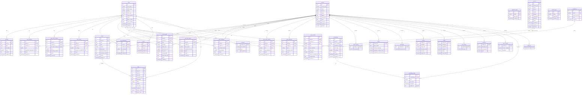

# Database Schema

Entity-relationship diagram for the Galipo legal case management system.

> **Auto-generated** on 2026-01-29 13:38:41 by `scripts/generate_schema_diagram.py`
>
> To regenerate: `python scripts/generate_schema_diagram.py`

## ER Diagram


```mermaid
erDiagram
    activities {
        int id PK
        int case_id FK
        date date
        text description
        varchar type
        int minutes
        timestamp created_at
    }

    attorneys {
        int contact_id PK,FK
        varchar bar_number
        varchar firm
        text firm_address
    }

    case_attorneys {
        int id PK
        int case_id UK,FK
        int contact_id UK,FK
        varchar role UK
        int represents_defendant_id FK
        text notes
        timestamp created_at
    }

    case_client_contacts {
        int id PK
        int case_id UK,FK
        int contact_id UK,FK
        int for_client_contact_id UK,FK
        varchar role
        boolean is_primary_contact
        text notes
        timestamp created_at
    }

    case_clients {
        int id PK
        int case_id UK,FK
        int contact_id UK,FK
        boolean is_primary
        int contact_via_contact_id FK
        text notes
        timestamp created_at
    }

    case_defendants {
        int id PK
        int case_id UK,FK
        int contact_id UK,FK
        boolean is_primary
        text notes
        timestamp created_at
    }

    case_experts {
        int id PK
        int case_id UK,FK
        int contact_id UK,FK
        varchar side UK
        varchar specialty
        numeric hourly_rate
        numeric deposition_rate
        numeric trial_rate
        date retained_date
        date report_due_date
        text notes
        timestamp created_at
    }

    case_lien_holders {
        int id PK
        int case_id UK,FK
        int contact_id UK,FK
        numeric lien_amount
        numeric negotiated_amount
        varchar status
        text notes
        timestamp created_at
    }

    case_mediators {
        int id PK
        int case_id UK,FK
        int contact_id UK,FK
        date scheduled_date
        numeric rate_override
        text notes
        timestamp created_at
    }

    case_other_contacts {
        int id PK
        int case_id UK,FK
        int contact_id UK,FK
        varchar role UK
        jsonb case_attributes
        text notes
        timestamp created_at
    }

    case_persons {
        int id PK
        int case_id UK,FK
        int person_id UK,FK
        varchar role UK
        varchar side
        jsonb case_attributes
        text case_notes
        boolean is_primary
        int contact_via_person_id FK
        date assigned_date
        timestamp created_at
    }

    case_witnesses {
        int id PK
        int case_id UK,FK
        int contact_id UK,FK
        varchar side
        text testimony_topic
        text notes
        timestamp created_at
    }

    cases {
        int id PK
        varchar case_name
        varchar short_name
        varchar status
        varchar print_code
        text case_summary
        text result
        date date_of_injury
        jsonb case_numbers
        timestamp created_at
        timestamp updated_at
    }

    client_contacts {
        int contact_id PK,FK
        varchar relationship
    }

    clients {
        int contact_id PK,FK
        date date_of_birth
        varchar preferred_language
        varchar emergency_contact_name
        varchar emergency_contact_phone
    }

    contacts {
        int id PK
        varchar contact_type
        varchar name
        jsonb phones
        jsonb emails
        text address
        varchar organization
        text notes
        timestamp created_at
        timestamp updated_at
        boolean archived
    }

    defendants {
        int contact_id PK,FK
        varchar defendant_type
    }

    events {
        int id PK
        int case_id FK
        date date
        time time
        varchar location
        text description
        text document_link
        text calculation_note
        boolean starred
        timestamp created_at
    }

    expertise_types {
        int id PK
        varchar name UK
        text description
        timestamp created_at
    }

    experts {
        int contact_id PK,FK
        _text expertises
        numeric hourly_rate
        numeric deposition_rate
        numeric trial_rate
        numeric retainer_fee
    }

    judges {
        int contact_id PK,FK
        varchar courtroom
        varchar department
        varchar chambers
        varchar initials
        varchar court_name
    }

    jurisdictions {
        int id PK
        varchar name UK
        text local_rules_link
        text notes
        timestamp created_at
    }

    lien_holders {
        int contact_id PK,FK
        varchar lien_type
    }

    mediators {
        int contact_id PK,FK
        numeric half_day_rate
        numeric full_day_rate
        varchar style
    }

    notes {
        int id PK
        int case_id FK
        text content
        timestamp created_at
        timestamp updated_at
    }

    other_contacts {
        int contact_id PK,FK
        varchar contact_subtype
        jsonb attributes
    }

    person_types {
        int id PK
        varchar name UK
        text description
        timestamp created_at
    }

    persons {
        int id PK
        varchar person_type
        varchar name
        jsonb phones
        jsonb emails
        text address
        varchar organization
        jsonb attributes
        text notes
        timestamp created_at
        timestamp updated_at
        boolean archived
    }

    proceeding_judges {
        int id PK
        int proceeding_id UK,FK
        varchar role
        int sort_order
        timestamp created_at
        int contact_id UK,FK
    }

    proceedings {
        int id PK
        int case_id FK
        varchar case_number
        int jurisdiction_id FK
        int sort_order
        boolean is_primary
        text notes
        timestamp created_at
        timestamp updated_at
    }

    tasks {
        int id PK
        int case_id FK
        int event_id FK
        date due_date
        date completion_date
        text description
        varchar status
        int urgency
        int sort_order
        timestamp created_at
        varchar docket_category
        int docket_order
    }

    witnesses {
        int contact_id PK,FK
    }

    %% Relationships
    cases ||--o{ activities : "has"
    contacts ||--o{ attorneys : "extends"
    cases ||--o{ case_attorneys : "has"
    contacts ||--o{ case_attorneys : "contact"
    cases ||--o{ case_client_contacts : "has"
    contacts ||--o{ case_client_contacts : "contact"
    cases ||--o{ case_clients : "has"
    contacts ||--o{ case_clients : "contact"
    cases ||--o{ case_defendants : "has"
    contacts ||--o{ case_defendants : "contact"
    cases ||--o{ case_experts : "has"
    contacts ||--o{ case_experts : "contact"
    cases ||--o{ case_lien_holders : "has"
    contacts ||--o{ case_lien_holders : "contact"
    cases ||--o{ case_mediators : "has"
    contacts ||--o{ case_mediators : "contact"
    cases ||--o{ case_other_contacts : "has"
    contacts ||--o{ case_other_contacts : "contact"
    cases ||--o{ case_persons : "has"
    persons ||--o{ case_persons : "contact_via_person"
    cases ||--o{ case_witnesses : "has"
    contacts ||--o{ case_witnesses : "contact"
    contacts ||--o{ client_contacts : "extends"
    contacts ||--o{ clients : "extends"
    contacts ||--o{ defendants : "extends"
    cases ||--o{ events : "has"
    contacts ||--o{ experts : "extends"
    contacts ||--o{ judges : "extends"
    contacts ||--o{ lien_holders : "extends"
    contacts ||--o{ mediators : "extends"
    cases ||--o{ notes : "has"
    contacts ||--o{ other_contacts : "extends"
    contacts ||--o{ proceeding_judges : "serves as"
    proceedings ||--o{ proceeding_judges : "has"
    cases ||--o{ proceedings : "has"
    jurisdictions ||--o{ proceedings : "filed in"
    cases ||--o{ tasks : "has"
    events ||--o{ tasks : "linked to"
    contacts ||--o{ witnesses : "extends"
```

## Table Relationships

| Parent | Child | FK Column | On Delete |
|--------|-------|-----------|-----------|
| cases | activities | case_id | CASCADE |
| contacts | attorneys | contact_id | CASCADE |
| cases | case_attorneys | case_id | CASCADE |
| contacts | case_attorneys | contact_id | CASCADE |
| contacts | case_attorneys | represents_defendant_id | NO ACTION |
| cases | case_client_contacts | case_id | CASCADE |
| contacts | case_client_contacts | contact_id | CASCADE |
| contacts | case_client_contacts | for_client_contact_id | NO ACTION |
| cases | case_clients | case_id | CASCADE |
| contacts | case_clients | contact_id | CASCADE |
| contacts | case_clients | contact_via_contact_id | NO ACTION |
| cases | case_defendants | case_id | CASCADE |
| contacts | case_defendants | contact_id | CASCADE |
| cases | case_experts | case_id | CASCADE |
| contacts | case_experts | contact_id | CASCADE |
| cases | case_lien_holders | case_id | CASCADE |
| contacts | case_lien_holders | contact_id | CASCADE |
| cases | case_mediators | case_id | CASCADE |
| contacts | case_mediators | contact_id | CASCADE |
| cases | case_other_contacts | case_id | CASCADE |
| contacts | case_other_contacts | contact_id | CASCADE |
| cases | case_persons | case_id | CASCADE |
| persons | case_persons | contact_via_person_id | NO ACTION |
| persons | case_persons | person_id | CASCADE |
| cases | case_witnesses | case_id | CASCADE |
| contacts | case_witnesses | contact_id | CASCADE |
| contacts | client_contacts | contact_id | CASCADE |
| contacts | clients | contact_id | CASCADE |
| contacts | defendants | contact_id | CASCADE |
| cases | events | case_id | CASCADE |
| contacts | experts | contact_id | CASCADE |
| contacts | judges | contact_id | CASCADE |
| contacts | lien_holders | contact_id | CASCADE |
| contacts | mediators | contact_id | CASCADE |
| cases | notes | case_id | CASCADE |
| contacts | other_contacts | contact_id | CASCADE |
| contacts | proceeding_judges | contact_id | CASCADE |
| proceedings | proceeding_judges | proceeding_id | CASCADE |
| cases | proceedings | case_id | CASCADE |
| jurisdictions | proceedings | jurisdiction_id | NO ACTION |
| cases | tasks | case_id | CASCADE |
| events | tasks | event_id | SET NULL |
| contacts | witnesses | contact_id | CASCADE |

## JSONB Column Details

### cases.case_numbers
```json
["2023-CV-12345", "2025-APP-00001"]
```
Tracks case across multiple courts/proceedings.

### contacts.phones / contacts.emails
```json
[
  {"value": "+1-555-1234", "primary": true, "label": "Cell"},
  {"value": "+1-555-5678", "primary": false, "label": "Office"}
]
```

### case_other_contacts.case_attributes
Flexible JSON for role-specific case data:
```json
{"specialty_for_case": "Accident Reconstruction", "testimony_topic": "Speed analysis"}
```

## Enum Values

### Case Statuses
- Signing Up, Prospective, Pre-Filing, Pleadings, Discovery
- Expert Discovery, Pre-trial, Trial, Post-Trial, Appeal
- Settl. Pend., Stayed, Closed

### Task Statuses
- Pending, Active, Done, Partially Done, Blocked, Awaiting Atty Review

### Task Urgency
- 1 = Low
- 2 = Medium (default)
- 3 = High
- 4 = Urgent

### Activity Types
- Meeting, Filing, Research, Drafting, Document Review
- Phone Call, Email, Court Appearance, Deposition, Other

### Contact Types (Discriminator)
- client, attorney, expert, judge, mediator, defendant
- lien_holder, witness, client_contact, other

### Case Assignment Sides
- plaintiff, defendant, neutral

## Schema Design Notes

### Class Table Inheritance Pattern
The `contacts` table serves as a base table with a `contact_type` discriminator column.
Type-specific tables (clients, attorneys, experts, etc.) extend contacts via foreign key
to `contacts.id` with `ON DELETE CASCADE`.

### Case Assignments
Each contact type has its own junction table (`case_clients`, `case_attorneys`, etc.)
rather than a single unified `case_persons` table. This allows type-specific fields
on the assignment (e.g., `case_experts` has `hourly_rate_override`, `case_lien_holders`
has `lien_amount` and `lien_status`).

### Multi-Jurisdiction Support
Cases can have multiple proceedings in different jurisdictions. The `proceedings` table
links cases to jurisdictions with case numbers. Judges are assigned to proceedings
(not cases) to support multi-judge panels.

### Soft Deletes
The `contacts.archived` boolean flag is used for soft deletes rather than removing rows.
